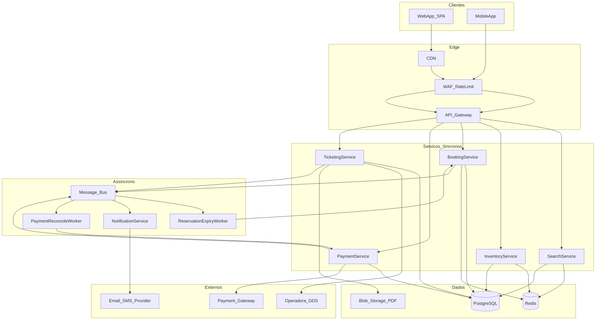
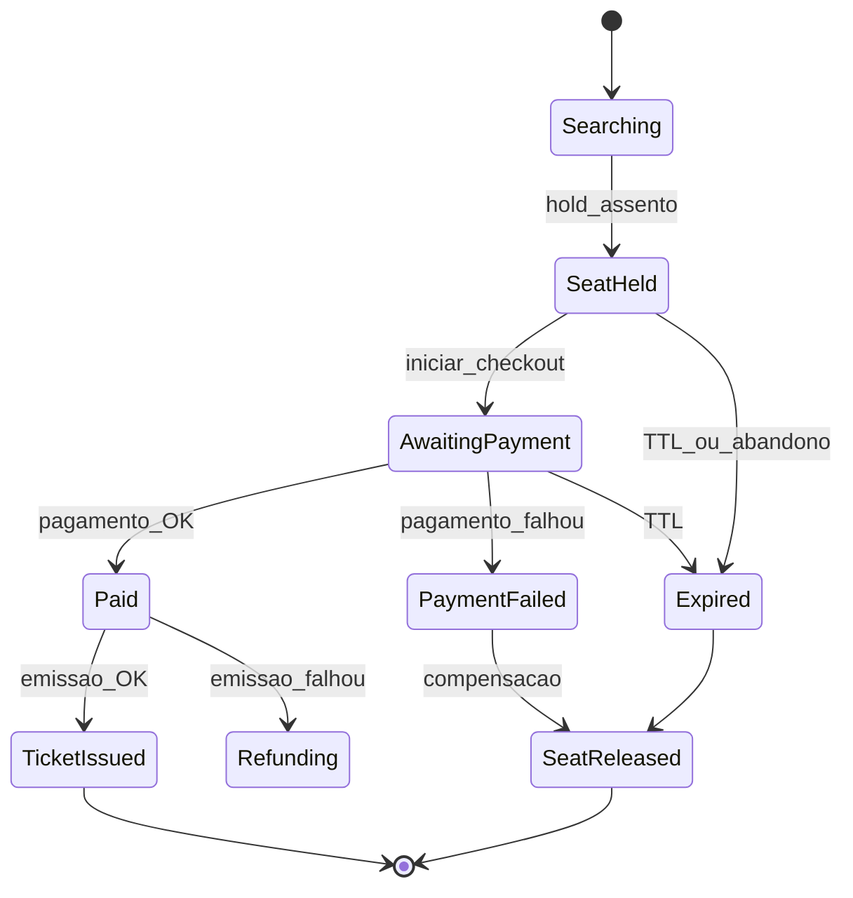

# Arquitetura de Alto Nível

Sistema B2C para busca, reserva temporária de assentos, pagamento e emissão de bilhete. Projetado para milhares de usuários simultâneos em picos, com consistência forte no inventário de assentos e consistência eventual em notificações.

## Stack

| Camada | Tecnologia |
|--------|------------|
| API | ASP.NET Core 8, MediatR, Serilog |
| Persistência | PostgreSQL + EF Core |
| Cache / Lock | Redis (SETNX + TTL) |
| Mensageria | RabbitMQ + MassTransit |
| Workers | .NET Worker Service |
| Infra local | Docker Compose |

## Diagrama de componentes

## Implementação neste repositório

O projeto adota um **modular monolith** com bounded contexts separados por pastas:

| Contexto | Projeto / Pasta | Responsabilidade |
|----------|-----------------|------------------|
| Search | `Application/Search` | Busca de viagens com cache Redis |
| Inventory | `Application/Inventory` | Mapa de assentos |
| Booking | `Application/Booking` | Reserva, pedido, compensação (saga) |
| Payment | `Application/Payments` | Pagamento idempotente |
| Ticketing | `Application/Ticketing` | Emissão de bilhete |
| Infra | `Infrastructure` | EF Core, Redis, RabbitMQ, mocks externos |
| Workers | `CompraPassagemOnline.Workers` | Expiração de reservas, reconciliação |

## Comunicação entre serviços

### Síncrona (HTTP)

Usada no fluxo crítico de checkout para manter latência baixa:

- `GET /api/trips` — busca
- `GET /api/trips/{id}/seats` — mapa de assentos
- `POST /api/reservations` — hold de assento
- `POST /api/orders` — criação de pedido
- `POST /api/payments` — pagamento e emissão

Implementação: controllers em [`CompraPassagemOnline.Api/Controllers/PurchaseFlowControllers.cs`](../CompraPassagemOnline.Api/Controllers/PurchaseFlowControllers.cs) delegando para handlers MediatR.

### Assíncrona (eventos)

Eventos publicados via MassTransit:

| Evento | Quando | Consumidor |
|--------|--------|------------|
| `SeatHeldEvent` | Reserva criada | Log / notificação futura |
| `SeatReleasedEvent` | Compensação ou expiração | Log |
| `PaymentConfirmedEvent` | Pagamento OK | Log |
| `PaymentFailedEvent` | Pagamento recusado | Log |
| `TicketIssuedEvent` | Bilhete emitido | Log / e-mail futuro |
| `ReservationExpiredEvent` | TTL expirado | Log |

Definições em [`CompraPassagemOnline.Application/Events/DomainEvents.cs`](../CompraPassagemOnline.Application/Events/DomainEvents.cs).

## Modelo de dados

Entidades em `CompraPassagemOnline.Domain/Entities`:

- **Trip** — viagem (origem, destino, horário, preço)
- **Seat** — assento (`Available | Held | Sold`)
- **Reservation** — hold com `ExpiresAt` (15 min)
- **Order** — pedido com passageiros
- **Payment** — tentativa com `IdempotencyKey` única
- **Ticket** — bilhete emitido

## Estados da reserva/pedido

