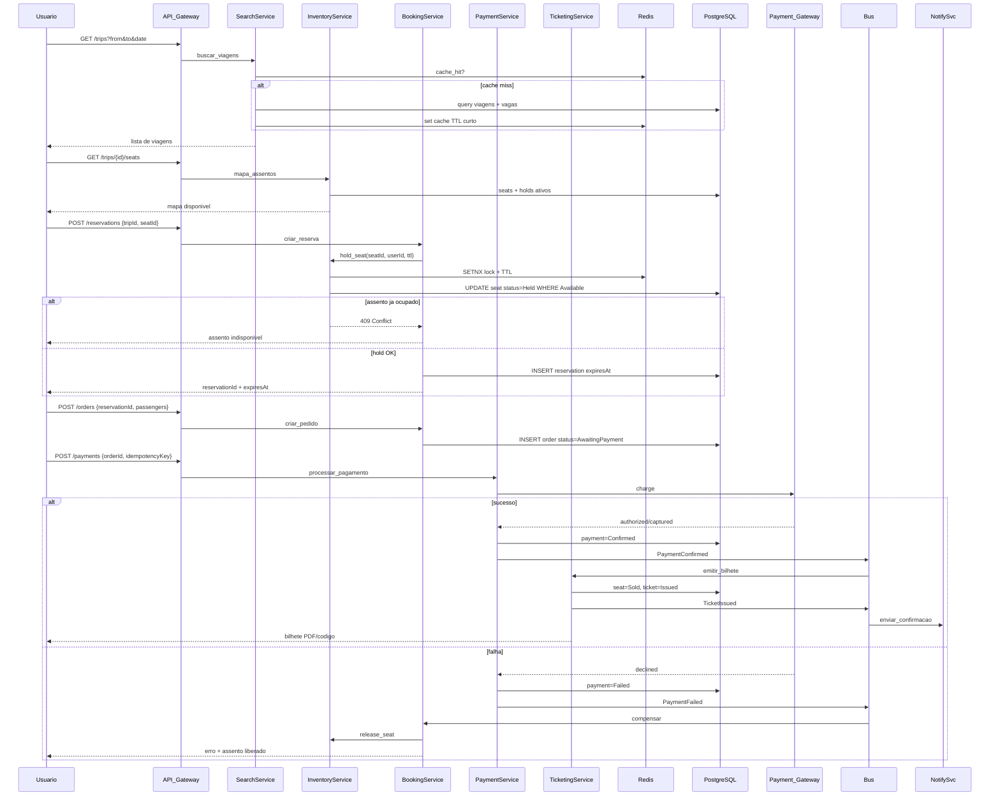

# Fluxo Principal — Busca → Reserva → Pagamento → Confirmação

## Sequence diagram (ponta a ponta)



## Mapeamento para a API implementada

| Etapa | Endpoint | Handler |
|-------|----------|---------|
| 1. Busca | `GET /api/trips?from=Sao Paulo&to=Rio de Janeiro&date=2026-05-30` | `SearchTripsQueryHandler` |
| 2. Mapa | `GET /api/trips/{tripId}/seats` | `GetSeatMapQueryHandler` |
| 3. Reserva | `POST /api/reservations` | `CreateReservationCommandHandler` |
| 4. Pedido | `POST /api/orders` | `CreateOrderCommandHandler` |
| 5. Pagamento | `POST /api/payments` | `ProcessPaymentCommandHandler` + `IssueTicketCommandHandler` |

## Exemplo de fluxo completo (curl)

```bash
# 1. Buscar viagens
curl "http://localhost:5000/api/trips?from=Sao%20Paulo&to=Rio%20de%20Janeiro&date=2026-05-30"

# 2. Mapa de assentos (usar tripId retornado ou seed fixo)
curl "http://localhost:5000/api/trips/11111111-1111-1111-1111-111111111111/seats"

# 3. Reservar assento
curl -X POST http://localhost:5000/api/reservations \
  -H "Content-Type: application/json" \
  -d '{"tripId":"11111111-1111-1111-1111-111111111111","seatId":"<SEAT_ID>","userId":"user-123"}'

# 4. Criar pedido
curl -X POST http://localhost:5000/api/orders \
  -H "Content-Type: application/json" \
  -d '{"reservationId":"<RESERVATION_ID>","passengers":[{"fullName":"Joao Silva","documentNumber":"12345678900"}]}'

# 5. Pagar e emitir bilhete
curl -X POST http://localhost:5000/api/payments \
  -H "Content-Type: application/json" \
  -d '{"orderId":"<ORDER_ID>","idempotencyKey":"pay-001"}'
```

## Detalhes de cada etapa

### 1. Busca

- Cache Redis com TTL de 60 segundos (`ReservationOptions.SearchCacheTtl`)
- Chave: `search:{origin}:{destination}:{date}`
- Índice DB em `(Origin, Destination, DepartureAt)`

### 2. Seleção de assento

- Retorna status `Available`, `Held` ou `Sold`
- Assentos `Held` aparecem indisponíveis para outros usuários
- Extensão futura: SignalR com Redis backplane para push em tempo real

### 3. Reserva (hold)

- Redis `SETNX` na chave `seat:{tripId}:{seatId}` com TTL de 15 minutos
- `UPDATE` condicional no PostgreSQL (`WHERE Status = Available`)
- Retorna `409 Conflict` se outro usuário ganhou a corrida
- Publica `SeatHeldEvent`

### 4. Pagamento

- `IdempotencyKey` única — retries seguros
- Valida reserva ainda ativa antes de cobrar
- `SimulateFailure: true` no body para testar compensação
- Saga: falha → `CompensateOrderCommand` → libera assento

### 5. Confirmação

- Emissão idempotente (reprocessar retorna bilhete existente)
- Assento marcado como `Sold`
- Código gerado: `TKT-{8 chars}`
- Publica `TicketIssuedEvent`
