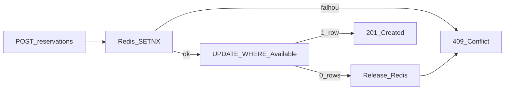
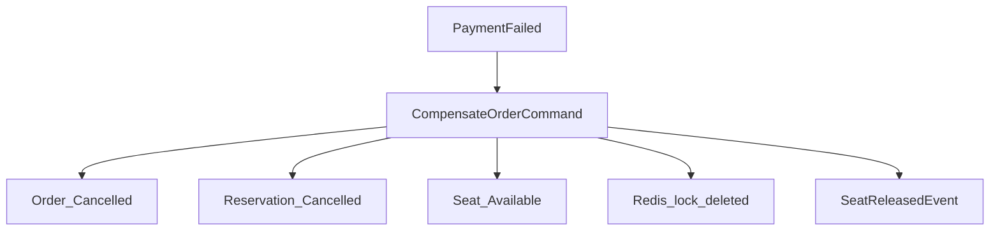
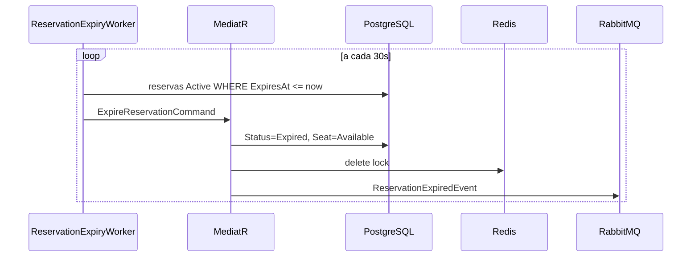

# Desafios Críticos — Concorrência, Falhas, Abandono e Escala

## 1. Dois usuários no mesmo assento (concorrência)

### Estratégia em camadas



### Camada 1 — Redis SETNX

Implementação em [`RedisSeatLockService`](../CompraPassagemOnline.Infrastructure/Caching/RedisServices.cs):

```csharp
await db.StringSetAsync(key, ownerId, ttl, When.NotExists);
```

- Chave: `seat:{tripId}:{seatId}`
- TTL: 15 minutos (espelha duração da reserva)
- Primeiro usuário ganha; demais recebem `false`

### Camada 2 — UPDATE condicional no PostgreSQL

Implementação em [`AppDatabase.TryHoldSeatAsync`](../CompraPassagemOnline.Infrastructure/Persistence/AppDatabase.cs):

```sql
UPDATE "Seats"
SET "Status" = 1, "Version" = "Version" + 1
WHERE "Id" = @seatId AND "Status" = 0
```

- `rows affected = 0` → conflito, Redis lock é liberado
- `Version` como token de concorrência otimista (EF Core)

### Camada 3 — Constraint única

Índice `(TripId, SeatNumber)` impede duplicata de assento na mesma viagem.

### Resposta ao cliente

Middleware retorna **409 Conflict** via `SeatConflictException`:

```json
{ "title": "Conflict", "detail": "Assento indisponível ou já reservado por outro usuário." }
```

### Fallback

Se Redis estiver indisponível, o UPDATE condicional no PostgreSQL ainda garante consistência (degraded mode com lock pessimista `SELECT FOR UPDATE` como extensão).

---

## 2. Falha no pagamento após reserva

### Saga com compensação



Handler: [`ProcessPaymentCommandHandler`](../CompraPassagemOnline.Application/Payments/ProcessPaymentCommandHandler.cs)

- Idempotência via `IdempotencyKey` única no índice DB
- Mesma key retorna resultado anterior sem nova cobrança
- `SimulateFailure: true` simula recusa do gateway em dev
- Polly retry no `MockPaymentGateway` para timeouts transientes

### Webhook + reconciliação

`PaymentReconcileWorker` roda a cada 5 minutos (placeholder para consulta ao gateway de pagamentos `Pending`).

### Estorno parcial

Se captura OK mas emissão falhar → estado `Refunding` (extensão futura com retry ou estorno automático).

---

## 3. Usuário abandona após reservar

### TTL automático

| Mecanismo | TTL | Onde |
|-----------|-----|------|
| Redis lock | 15 min | `ReservationOptions.HoldDuration` |
| Reservation.ExpiresAt | 15 min | Coluna no PostgreSQL |
| Worker scan | 30 seg | `ReservationExpiryWorker` |

### Fluxo de expiração



Implementação: [`ExpireReservationCommandHandler`](../CompraPassagemOnline.Application/Ticketing/TicketingCommandHandlers.cs)

### Limpeza de pedidos

Pedidos `AwaitingPayment` com reserva expirada falham no pagamento com mensagem clara: *"Reserva expirada. Selecione o assento novamente."*

---

## 4. Escalar para picos de acesso

| Camada | Tática | Status no repo |
|--------|--------|----------------|
| Edge | CDN, WAF, rate limit | Middleware correlation-id; rate limit = extensão |
| API | HPA, stateless | API stateless pronta para réplicas |
| Busca | Cache Redis, read replicas | Cache implementado |
| Inventário | Redis Cluster, sharding por tripId | Lock por assento implementado |
| Pagamento | Circuit breaker, retry | Polly no gateway mock |
| DB | PgBouncer, índices, particionamento | Índices no DbContext |
| Real-time | SignalR + Redis backplane | Documentado como extensão |

### Capacity planning

Exemplo para whiteboard:

- 10.000 usuários simultâneos × 2 req/s = ~20.000 RPS no edge
- Fluxo de reserva ≈ 5–10% → 1.000–2.000 RPS nos serviços críticos
- Load test recomendado: k6 ou Locust antes de feriados

### Métricas sugeridas (OpenTelemetry)

- `hold_success_rate`
- `hold_conflict_rate`
- `payment_failure_rate`
- `reservation_expiry_count`
- `checkout_latency_p99`
