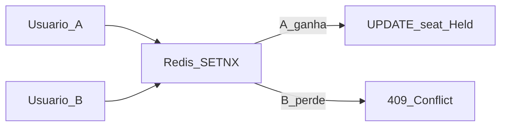
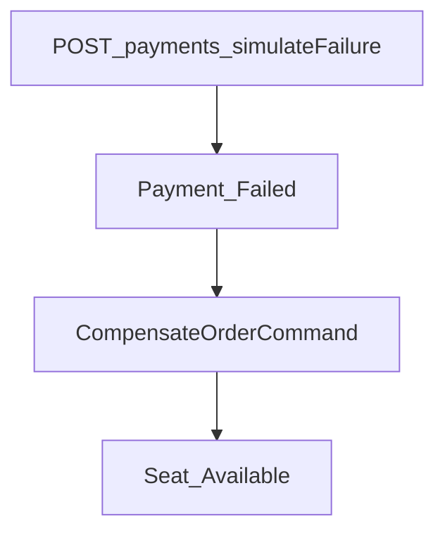

# Validar os 4 cenários críticos

Este guia explica **o que testar**, **como executar** e **como ler os resultados** para os desafios descritos em [03-challenges.md](03-challenges.md).

## Visão geral

| #   | Cenário                         | Comportamento esperado                     | Automação                             |
| --- | ------------------------------- | ------------------------------------------ | ------------------------------------- |
| 1   | Dois usuários, mesmo assento    | Um `201`, outro `409`; assento fica `Held` | `ConcurrentSeatPurchaseTests`         |
| 2   | Falha no pagamento após reserva | `CompensateOrderCommand` libera assento    | `PaymentFailureAfterReservationTests` |
| 3   | Abandono após reservar          | TTL expira → assento `Available`           | `ReservationAbandonmentTests`         |
| 4   | Pico de acesso                  | API aguenta buscas + holds paralelos       | `ScalingSmokeTests`, k6               |

---

## 1. Concorrência no mesmo assento

### O que acontece

Dois clientes tentam `POST /api/reservations` no mesmo `seatId` ao mesmo tempo.

### Como o sistema reage



### Como executar

```powershell
# Testes automatizados (Docker + Testcontainers)
dotnet test CompraPassagemOnline.Tests --filter ConcurrentSeatPurchase

# Demo narrativa (API rodando)
.\scripts\run-challenge-scenarios.ps1
```

### O que observar

| Sinal                     | Significado              |
| ------------------------- | ------------------------ |
| HTTP `201` + `409`        | Proteção funcionando     |
| Assento `Held` (status 1) | Apenas um hold ativo     |
| Dois `201`                | Bug — investigar lock/DB |

---

## 2. Falha no pagamento após reserva

### O que acontece

Reserva e pedido criados; gateway recusa o pagamento.

### Como o sistema reage



### Como executar

```powershell
dotnet test --filter PaymentFailureAfterReservation
.\scripts\run-challenge-scenarios.ps1
```

Body de exemplo:

```json
{
  "orderId": "...",
  "idempotencyKey": "unique-key",
  "simulateFailure": true
}
```

### O que observar

| Sinal                       | Significado                            |
| --------------------------- | -------------------------------------- |
| `payment.status` = `Failed` | Gateway recusou                        |
| Assento volta a `Available` | Compensação OK                         |
| Mesma `idempotencyKey`      | Retorno idempotente, sem nova cobrança |

---

## 3. Abandono após reservar

### O que acontece

Usuário reserva e não conclui o checkout. Após o TTL (`Reservation:HoldDuration`), o assento deve voltar ao inventário.

| Ambiente | `HoldDuration` | `ExpiryWorkerInterval` |
| -------- | -------------- | ---------------------- |
| Development (`dotnet run`) | **1 min** | 10 s |
| Testing (`dotnet test`) | 5 s | 2 s |
| Base (`appsettings.json`) | 15 min (referência produção) | 30 s |

### Como o sistema reage

O `ReservationExpiryWorker` (intervalo configurável) busca reservas `Active` com `ExpiresAt <= now` e executa `ExpireReservationCommand`.

### Como executar

```powershell
# Teste rápido (ambiente Testing: TTL 5s)
dotnet test --filter ReservationAbandonment

# Demo com worker (Development: TTL 1 min)
dotnet run --project CompraPassagemOnline.Workers
dotnet run --project CompraPassagemOnline.Api
.\scripts\run-challenge-scenarios.ps1 -WaitForExpiry

# Aguarda 75 s por padrao (1 min TTL + intervalo do worker). Ajuste: -ExpiryWaitSeconds 90
```

### O que observar

| Sinal                          | Significado                                                      |
| ------------------------------ | ---------------------------------------------------------------- |
| Assento `Available` após TTL   | Expiração OK                                                     |
| Pedido `AwaitingPayment` órfão | Comportamento atual documentado — expiração não cancela o pedido |
| Pagamento após expiração       | Erro _"Reserva expirada..."_                                     |

---

## 4. Escalar para picos de acesso

### O que acontece

Muitos usuários buscam viagens e tentam reservar assentos em paralelo.

### Como o sistema reage

- API **stateless** (réplicas horizontais possíveis)
- **Redis** para lock de assento e cache de busca
- **Workers** para expiração assíncrona
- Holds em assentos **diferentes** não devem conflitar

### Como executar

```powershell
# Smoke paralelo (integração)
dotnet test --filter ScalingSmoke

# Load test k6 (API + infra + Workers recomendado para reciclar assentos)
dotnet run --project CompraPassagemOnline.Workers   # outro terminal
$env:BASE_URL = "http://localhost:5102"
k6 run scripts/load/k6-scenarios.js

# Exportar JSON para análise
k6 run --summary-export=reports/k6-summary.json scripts/load/k6-scenarios.js

# Fluxo completo com reset
.\scripts\run-challenge-scenarios.ps1 -ResetData
```

Com **Development** (`HoldDuration` 1 min) e **Workers** rodando, assentos reservados no início do k6 podem voltar a `Available` antes do teste terminar (~1m50s), permitindo mais `hold_success` além dos 40 iniciais.

Variáveis opcionais: `SEARCH_VUS`, `HOLD_VUS`, `CONTENTION_VUS`, `TRIP_ID`, `BASE_URL`.

### Interpretação humana das métricas k6

| Métrica                   | Leitura                                                                  |
| ------------------------- | ------------------------------------------------------------------------ |
| `http_req_failed`         | Deve ficar < 5% — erros 5xx ou timeouts                                  |
| `http_req_duration p(95)` | Latência percebida no pico; alvo < 2s em lab                             |
| `hold_success`            | Reservas criadas; threshold exige `count > 0`                          |
| `hold_conflict`           | 409 — esperado nos primeiros `CONTENTION_VUS`                            |
| `hold_inventory_empty`    | Sem assentos no momento; cai se Workers reciclam após TTL                |
| `hold_errors`             | Falhas reais (GET/POST fora de 201/409) — investigar                   |

**Capacity planning (referência):** 10.000 usuários × 2 req/s ≈ 20.000 RPS no edge; ~5–10% no fluxo de reserva ≈ 1.000–2.000 RPS nos serviços críticos ([03-challenges.md](03-challenges.md)).

---

## Saída narrativa nos testes xUnit

Com `dotnet test -v n`, cada teste imprime um relatório em português:

```
[Cenário 1] Concorrência no assento 01
  Usuário A reserva                          OK (201)
  Usuário B reserva                          CONFLITO (409)
  Estado final — Assento: Held | Reservas bem-sucedidas: 1
```

Implementação: `CompraPassagemOnline.Tests/Infrastructure/ScenarioReporter.cs`.

---

## Limpar dados entre execuções

O script [`scripts/run-challenge-scenarios.ps1`](../scripts/run-challenge-scenarios.ps1) mostra **quantos assentos estão Available** no início. Se o inventário estiver zerado, os cenários 1–3 falham com mensagem clara (evita `seatId` inválido / HTTP 400).

### Reset manual (PostgreSQL + Redis)

```powershell
.\scripts\reset-test-data.ps1
```

Remove reservas, pedidos e pagamentos; define todos os assentos como `Available`; executa `FLUSHALL` no Redis.

### Antes do k6 (pergunta interativa)

Ao rodar o script **com k6 instalado** e **sem** `-SkipK6`, antes do load test aparece:

```text
Deseja limpar dados de teste (PostgreSQL + Redis) antes do k6?
  [S] Sim   [N] Nao (padrao)
```

| Parâmetro        | Efeito                                            |
| ---------------- | ------------------------------------------------- |
| (nenhum)         | Pergunta só antes do k6                           |
| `-ResetData`     | Limpa automaticamente antes do k6 (sem perguntar) |
| `-NoResetPrompt` | Nunca pergunta nem limpa                          |
| `-SkipK6`        | Não roda k6; smoke paralelo no PowerShell         |

Exemplos:

```powershell
.\scripts\run-challenge-scenarios.ps1
.\scripts\run-challenge-scenarios.ps1 -ResetData
.\scripts\run-challenge-scenarios.ps1 -SkipK6 -ParallelReservations 15
```

### Cenário 4 (smoke PowerShell)

- **`0/0` assentos** → marcado como **FALHOU** (não conta mais como sucesso vazio).
- Exige **100%** de `201` nas reservas tentadas (`ok == seats.Count` e `seats.Count > 0`).

---

## Limitações conhecidas (comportamento atual)

Os testes validam o contrato **atual**, incluindo:

- Sem transação única englobando Redis + PostgreSQL + reserva
- `PaymentReconcileWorker` ainda é placeholder
- Expiração não cancela pedidos `AwaitingPayment` órfãos

Veja [04-trade-offs.md](04-trade-offs.md) para evoluções sugeridas.
